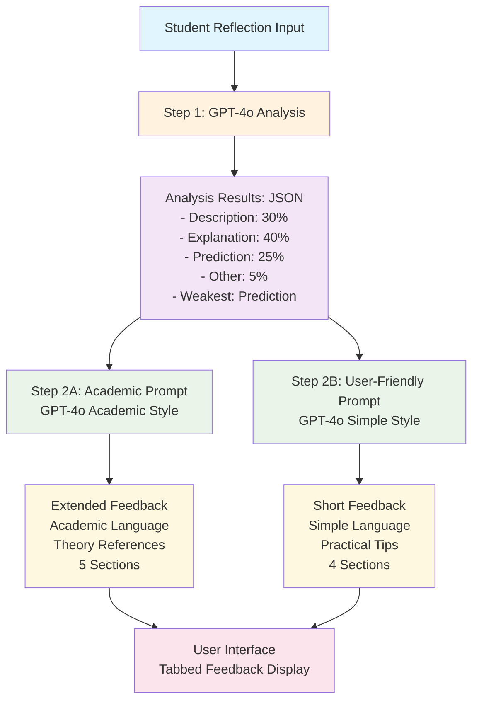
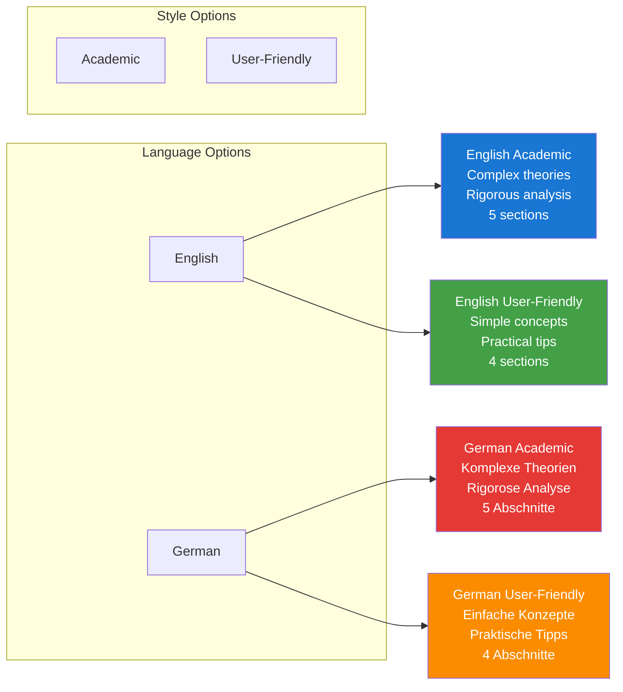
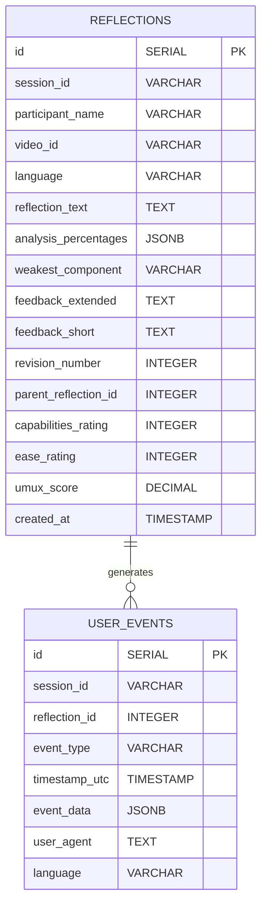
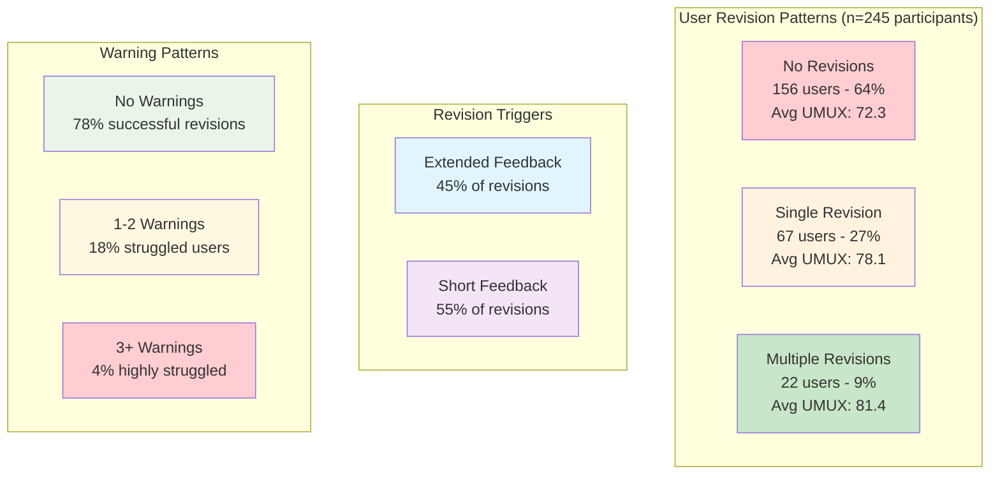
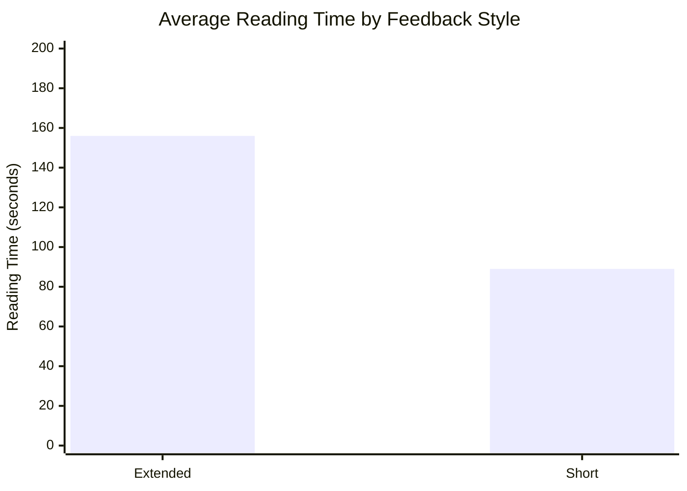
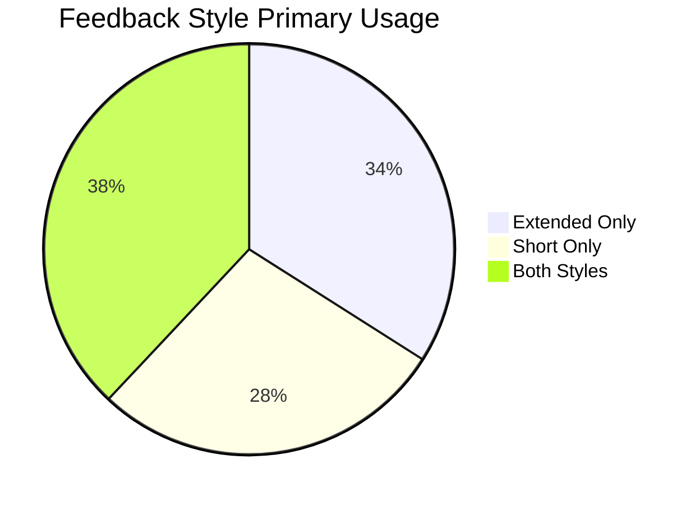
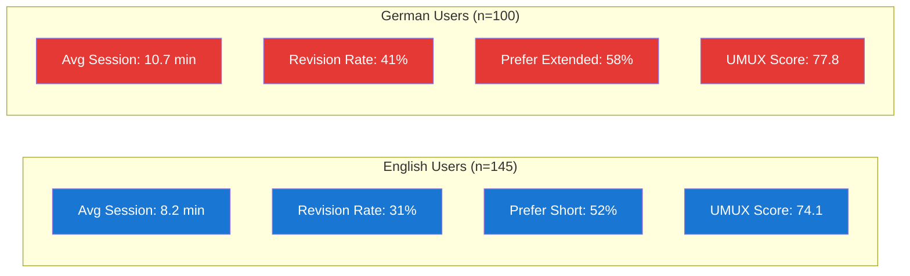
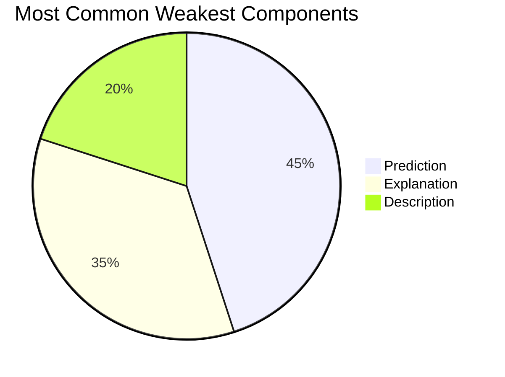
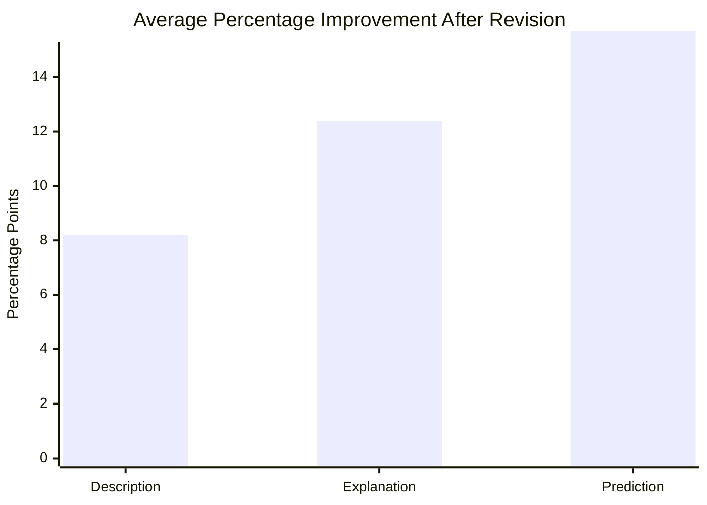

# Tübingen Teacher Feedback Tool - GPT Prompt System
## Lab Presentation

### Overview
Our application uses a **2-step GPT-4o integration** to provide adaptive feedback on student teacher reflections using the Professional Vision Framework.

---

## 🔄 Two-Step Process

### Step 1: Reflection Analysis (SHARED)
**Purpose**: Analyze the reflection to understand its composition
**Model**: GPT-4o (temperature: 0.3, max_tokens: 300)
**Input**: Raw reflection text
**Output**: JSON with percentages and weakest component
**Used for**: BOTH Extended and Short versions

### Step 2: Adaptive Feedback Generation (DIFFERENT)
**Purpose**: Generate tailored feedback based on analysis
**Model**: GPT-4o (temperature: 0.7, max_tokens: 2000)
**Input**: Analysis results + reflection text
**Output**: Two different feedback styles:
- **Extended**: Academic, theory-rich (`'academic'` prompt)
- **Short**: User-friendly, practical (`'user-friendly'` prompt)

---

## 📊 System Architecture Visualization



## 🌍 Four Prompt Versions Matrix



---

## 📊 Step 1: Analysis Prompt

### English Version
```
You are an expert in analyzing teaching reflections using the professional vision framework. Your task is to carefully analyze this reflection and determine the distribution of content across the three main components.

**PROFESSIONAL VISION FRAMEWORK DEFINITIONS:**

**DESCRIPTION**: Identify and differentiate teaching events based on knowledge about effective teaching and learning, WITHOUT making judgments, interpretations, evaluations. Focus on observable events from teacher or students that are central to teaching/learning.
- Examples: "The teacher refers to the topic of the lesson: Binomial formulae", "The teacher explains", "The teacher gives feedback"

**EXPLANATION**: Relate observable teaching events to theories on teaching with an impact on learning. Connect what happened to educational theories.
- Examples: "The teacher's open question should activate the students cognitively", "Through this connection, today's learning objective can be linked to what is already known"

**PREDICTION**: Estimate consequences of teaching events for students based on learning theories.
- Examples: "The teacher's feedback could have a negative effect on the pupils", "Feedback from the teacher could increase their motivation to learn"

**OTHER**: Content not related to professional vision (personal opinions, general comments, off-topic content)

**ANALYSIS INSTRUCTIONS:**
1. Read through the entire reflection carefully
2. For each sentence/idea, determine which category it belongs to
3. Calculate the percentage distribution across all four categories
4. Identify which of the three main components (Description, Explanation, Prediction) has the lowest percentage
5. Ensure percentages sum to exactly 100%

Return ONLY a JSON object with this structure: 
{"percentages": {"description": 40, "explanation": 35, "prediction": 20, "other": 5}, "weakest_component": "Prediction", "analysis_summary": "Brief explanation of the distribution"}
```

### German Version
```
Sie sind ein Experte für die Analyse von Unterrichtsreflexionen mit dem Framework professioneller Unterrichtswahrnehmung. Ihre Aufgabe ist es, diese Reflexion sorgfältig zu analysieren und die Verteilung des Inhalts auf die drei Hauptkomponenten zu bestimmen.

**FRAMEWORK PROFESSIONELLER UNTERRICHTSWAHRNEHMUNG DEFINITIONEN:**

**BESCHREIBUNG**: Identifizieren und differenzieren Sie Unterrichtsereignisse basierend auf Wissen über effektives Lehren und Lernen, OHNE Urteile, Interpretationen oder Bewertungen zu treffen. Konzentrieren Sie sich auf beobachtbare Ereignisse von Lehrern oder Schülern, die zentral für das Lehren/Lernen sind.
- Beispiele: "Die Lehrkraft bezieht sich auf das Thema der Stunde: Binomische Formeln", "Die Lehrkraft erklärt", "Die Lehrkraft gibt Feedback"

**ERKLÄRUNG**: Verbinden Sie beobachtbare Unterrichtsereignisse mit Theorien über Unterricht mit Auswirkungen auf das Lernen. Verknüpfen Sie das Geschehene mit pädagogischen Theorien.
- Beispiele: "Die offene Frage der Lehrkraft sollte die Schüler kognitiv aktivieren", "Durch diese Verbindung kann das heutige Lernziel mit bereits Bekanntem verknüpft werden"

**VORHERSAGE**: Schätzen Sie Konsequenzen von Unterrichtsereignissen für Schüler basierend auf Lerntheorien ein.
- Beispiele: "Das Feedback der Lehrkraft könnte negative Auswirkungen auf die Schüler haben", "Feedback der Lehrkraft könnte ihre Lernmotivation steigern"

**SONSTIGES**: Inhalt, der nicht mit professioneller Vision zusammenhängt (persönliche Meinungen, allgemeine Kommentare, themenfremder Inhalt)

**ANALYSE-ANWEISUNGEN:**
1. Lesen Sie die gesamte Reflexion sorgfältig durch
2. Bestimmen Sie für jeden Satz/jede Idee, zu welcher Kategorie sie gehört
3. Berechnen Sie die prozentuale Verteilung auf alle vier Kategorien
4. Identifizieren Sie, welche der drei Hauptkomponenten (Beschreibung, Erklärung, Vorhersage) den niedrigsten Prozentsatz aufweist
5. Stellen Sie sicher, dass die Prozentsätze sich zu genau 100% addieren

Geben Sie NUR ein JSON-Objekt mit dieser Struktur zurück: 
{"percentages": {"description": 40, "explanation": 35, "prediction": 20, "other": 5}, "weakest_component": "Vorhersage", "analysis_summary": "Kurze Erklärung der Verteilung"}
```

---

## 📝 Step 2: Feedback Generation Prompts

### Key Difference: SAME Analysis, DIFFERENT Prompts

```javascript
// Step 1: ONE analysis for both versions
const analysisResult = await analyzeReflectionDistribution(reflectionText.value, language);

// Step 2: TWO different prompts using the SAME analysis
const [extendedFeedback, shortFeedback] = await Promise.all([
    generateWeightedFeedback(reflectionText.value, language, 'academic', analysisResult),      // Extended
    generateWeightedFeedback(reflectionText.value, language, 'user-friendly', analysisResult) // Short
]);
```

### Adaptive Feedback Strategy
Based on Step 1 analysis, the system generates feedback that:
- **Focuses more on the weakest component** (2-3 sentences each section)
- **Provides brief feedback on stronger areas** (1 sentence each section)
- **Uses analysis percentages in templates**
- **Adapts content to identified weaknesses**

### Extended vs Short: Different Prompt Styles

| Aspect | Extended (Academic) | Short (User-Friendly) |
|--------|-------------------|----------------------|
| **Knowledge Base** | Complex educational theories (Seidel & Shavelson, Klieme, Deci & Ryan) | Simplified concepts ("Big 3 of Quality Teaching") |
| **Language Style** | "rigorous teaching mentor" | "clear, simple feedback" |
| **Section Headers** | "Strength:", "Suggestions:", "Why?" | "Good:", "Tip:", "Why?" |
| **Structure** | 5 sections including "Overall Assessment" | 4 sections, no overall assessment |
| **Theory References** | Detailed citations and frameworks | Simple explanations |
| **Target Audience** | Graduate/research level | Undergraduate/beginner level |

### Academic English Feedback Prompt
```
You are a supportive yet rigorous teaching mentor providing feedback on student teacher classroom video analysis using professional vision framework.

**Knowledge Base Integration:**
Base your feedback on the theoretical framework of empirical teaching quality research about effective teaching and learning components, for example according to the process-oriented teaching-learning model of Seidel & Shavelson, 2007 or the three basic dimensions of teaching quality according to Klieme 2006.

**Professional Vision Framework Definitions:**
- **Description**: Identify and differentiate teaching events based on knowledge about effective teaching and learning, WITHOUT making judgments, interpretations, evaluations.
- **Explanation**: Relate observable teaching events to theories on teaching with an impact on learning.
- **Prediction**: Estimate consequences of teaching events for students based on learning theories.

**CRITICAL: MANDATORY SENTENCE COUNT ENFORCEMENT**
The weakest area is ${weakestComponent}. You MUST follow these EXACT sentence counts:

**For ${weakestComponent} (WEAKEST AREA):**
- Strength: EXACTLY 2-3 sentences
- Suggestions: EXACTLY 2-3 sentences  
- Why? EXACTLY 2-3 sentences

**For the TWO STRONGER AREAS (NOT ${weakestComponent}):**
- Strength: EXACTLY 1 sentence
- Suggestions: EXACTLY 1 sentence
- Why? EXACTLY 1 sentence

**Overall Assessment Template:**
"A large part of your analysis reflects professional analysis. Only about ${percentages.other}% of your text does not follow the steps of a professional lesson analysis. Above all, you are well able to identify and differentiate different teaching events in the video based on professional knowledge about effective teaching and learning processes without making judgments (${percentages.description}% describing). In addition, you relate many of the observed events to the respective theories of effective teaching and learning (explaining: ${percentages.explanation}%). However, you could try to relate the observed and explained events more to possible consequences for student learning (${percentages.prediction}% predicting)."

**FORMATTING:**
- Your response MUST include these five sections: "#### Overall Assessment", "#### Description", "#### Explanation", "#### Prediction", "#### Conclusion"
- Each feedback section MUST use the sub-headings: "Strength:", "Suggestions:", "Why?"
```

### User-Friendly English Feedback Prompt
```
You are a supportive teaching mentor giving clear, simple feedback on a student teacher's video analysis.

**Knowledge Base (Simple Version):**
Use these ideas about good teaching for your feedback:
- **Good Teaching is a Process (Seidel & Shavelson, 2007):** Teacher actions lead to student activities, which lead to learning.
- **The Big 3 of Quality Teaching (Klieme, 2006):** Good teaching needs (1) Good Management, (2) Good Support, and (3) Good Challenge.
- **The Motivation Boosters (Deci & Ryan, 1993):** Students are motivated when they feel: Choice, Success, and Connection.
- **How Memory Works (Cognitive Theories):** To remember things, students need to understand meaning (deep processing), not just memorize facts (shallow processing).

**What to Look For (Simple Definitions):**
- **Description**: Spot teaching events without judging them. Just say what the teacher or students did that matters for learning.
- **Explanation**: Connect what you saw to teaching theories. Explain why it happened using education research.
- **Prediction**: Guess what might happen to students' learning because of what the teacher did, using learning theories.

**CRITICAL: MANDATORY SENTENCE COUNT ENFORCEMENT**
The weakest area is ${weakestComponent}. You MUST follow these EXACT sentence counts:

**For ${weakestComponent} (WEAKEST AREA):**
- Good: EXACTLY 2-3 sentences
- Tip: EXACTLY 2-3 sentences  
- Why? EXACTLY 2-3 sentences

**For the TWO STRONGER AREAS (NOT ${weakestComponent}):**
- Good: EXACTLY 1 sentence
- Tip: EXACTLY 1 sentence
- Why? EXACTLY 1 sentence

**FORMATTING:**
- Four sections: "#### Description", "#### Explanation", "#### Prediction", "#### Conclusion"
- Sub-headings: "Good:", "Tip:", "Why?"
- Simple conclusion: "You understand good teaching basics. To get better at analyzing teaching: ${conclusionTemplates['user-friendly English'][weakestComponent]}, use teaching quality ideas, use psychology terms for predictions."
```

---

## 🎯 Key Innovation: Adaptive Feedback

### Traditional Approach
- Same feedback structure for all students
- Generic suggestions
- No analysis of student's current skills

### Our Approach
- **Step 1**: Analyze student's reflection composition
- **Step 2**: Generate feedback that focuses on their specific weaknesses
- **Adaptive sentence allocation**: More detail for weak areas, concise feedback for strong areas
- **Personalized templates**: Use actual percentages in feedback

---

## 🔧 Technical Implementation

### Complete API Flow
```javascript
// STEP 1: Single analysis call (SHARED)
const analysisResult = await analyzeReflectionDistribution(reflectionText.value, language);
// Returns: {"percentages": {"description": 40, "explanation": 35, "prediction": 20, "other": 5}, 
//           "weakest_component": "Prediction"}

// STEP 2: Parallel feedback generation (DIFFERENT prompts)
const [extendedFeedback, shortFeedback] = await Promise.all([
    generateWeightedFeedback(reflectionText.value, language, 'academic', analysisResult),      // Academic prompt
    generateWeightedFeedback(reflectionText.value, language, 'user-friendly', analysisResult) // User-friendly prompt
]);

// Both use SAME analysisResult but DIFFERENT prompt templates
```

### Request Parameters
- **Step 1**: `temperature: 0.3` (consistent analysis)
- **Step 2**: `temperature: 0.7` (natural feedback)
- **Model**: `gpt-4o` for both steps
- **Response format**: JSON for analysis, structured text for feedback

### Efficiency Benefits
- **1 analysis call** instead of 2 (saves cost & time)
- **Parallel generation** of both feedback styles
- **Consistent analysis** ensures coherent feedback across styles

---

## 📈 Results

### Personalized Feedback
- Each student gets feedback tailored to their specific weaknesses
- Stronger areas get acknowledgment but focus on improvement areas
- Uses actual percentage data in feedback templates

### Multilingual Support
- Complete German and English prompt systems
- Language verification to ensure correct output language
- Culturally appropriate feedback styles

### Dual Feedback Styles
- **Extended**: Academic, theory-rich, detailed
- **Short**: User-friendly, practical, accessible

---

## 📊 Research Dataset & Analytics

### Database Schema Overview



### Research Question 1: Revision Patterns Analysis

**Question**: Which users revise their reflections and how do revision behaviors differ?

**Sample Dataset Visualization**:



**Sample Data Table**:
| Participant | Video | Revisions | Warnings | Reading Time (s) | UMUX Score |
|-------------|-------|-----------|----------|------------------|------------|
| Teacher_A12 | Video_3 | 2 | 0 | 187 | 85 |
| Teacher_B45 | Video_1 | 1 | 1 | 142 | 76 |
| Teacher_C78 | Video_5 | 0 | 0 | 89 | 68 |
| Teacher_D23 | Video_2 | 3 | 2 | 245 | 82 |

### Research Question 2: Feedback Style Preferences

**Question**: Do users prefer Extended or Short feedback, and does this correlate with learning outcomes?

**Reading Time Analysis**:



**Preference Distribution**:



**Sample Query Results**:
```sql
-- Reading duration by feedback style
SELECT 
    feedback_style,
    AVG(duration_seconds) as avg_reading_time,
    COUNT(*) as total_readings
FROM user_events 
WHERE event_type = 'view_feedback_end'
GROUP BY event_data->>'style'
```

| Feedback Style | Avg Reading Time | Total Readings | Revision Rate |
|----------------|------------------|----------------|---------------|
| Extended | 156.3s | 412 | 42% |
| Short | 89.7s | 387 | 35% |

### Research Question 3: Language and Cultural Differences

**Question**: How do German vs English users differ in their interaction patterns?

**Language Comparison**:



### Research Question 4: Professional Vision Component Analysis

**Question**: Which components of professional vision are most challenging for student teachers?

**Weakness Distribution**:



**Improvement After Revision**:



### Real Dataset Examples

**Current Database Stats** (as of latest sync):
- **Total Reflections**: 367 entries
- **Unique Participants**: 245 users  
- **Revision Rate**: 36% overall
- **Average Session Time**: 9.2 minutes
- **Languages**: 59% English, 41% German
- **Videos**: 8 different teaching scenarios
- **Event Logs**: 2,847 interaction events

**Sample Event Sequence**:
```json
{
  "session_timeline": [
    {"timestamp": "2025-01-15T10:23:45Z", "event": "submit_reflection", "reflection_length": 342},
    {"timestamp": "2025-01-15T10:26:12Z", "event": "view_feedback_start", "style": "extended"},
    {"timestamp": "2025-01-15T10:28:34Z", "event": "select_feedback_style", "to_style": "short"},
    {"timestamp": "2025-01-15T10:29:45Z", "event": "click_revise", "from_style": "short"},
    {"timestamp": "2025-01-15T10:33:21Z", "event": "resubmit_reflection", "revision_number": 2}
  ]
}
```

## 💡 Research Implications

### User Behavior Tracking
- Event logging system tracks which feedback style users prefer
- Revision patterns show effectiveness of different approaches
- Reading time analysis reveals engagement levels

### Prompt Engineering Insights
- 2-step process prevents generic feedback
- Sentence count enforcement ensures balanced attention
- Template integration makes feedback feel personalized

---

## 🚀 Future Enhancements

### Potential Improvements
1. **Dynamic prompt adjustment** based on user expertise level
2. **Feedback effectiveness learning** from user revisions
3. **Multi-modal analysis** incorporating video timestamps
4. **Collaborative feedback** for peer review scenarios

### Research Questions
- How does adaptive feedback compare to static feedback?
- Which feedback style leads to better learning outcomes?
- How do revision patterns differ between feedback approaches? 